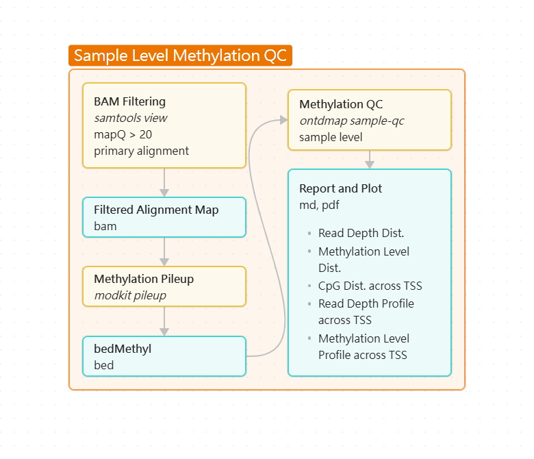
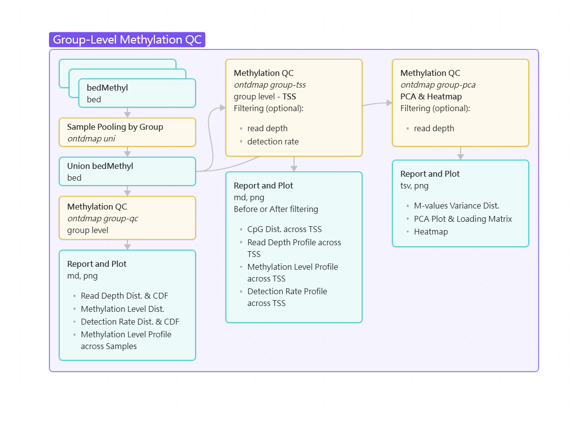
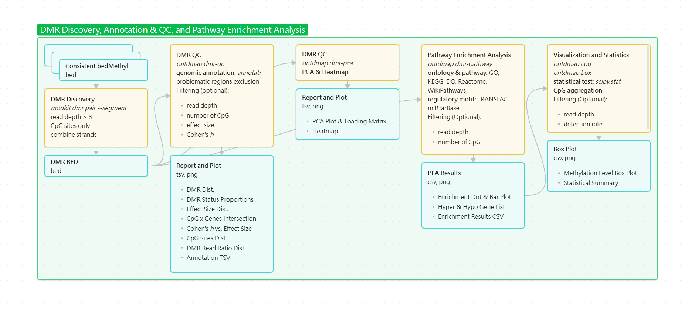

# ONTdMAP: ONT DNA Methylation Analysis Pipeline

**ONTdMAP** is a comprehensive, Python-based bioinformatics toolkit designed for the multi-level quality control, profiling, and downstream analysis of DNA (gDNA & cfDNA) CpG methylation (5mC & 5hmC) using Oxford Nanopore Technologies (ONT) sequencing data. 

This pipeline processes [modkit](https://github.com/nanoporetech/modkit) outputs and scales from single-sample metrics to group-level comparisons. The workflow includes:
- **Quality Control (QC)**: Evaluates global and region-specific read depth and methylation profiles at both sample and group levels.
- **Spatial Profiling**: Maps methylation and read depth distributions within targeted genomic windows (e.g., Transcription Start Sites).
- **Dimensionality Reduction**: Executes PCA and hierarchical clustering on both CpG beta-values and M-values.
- **DMR Isolation & Annotation**: Appiles multi-criterion filtering, masks artifact-prone regions via ENCODE blacklists, and annotates intervals using [annotatr](https://github.com/rcavalcante/annotatr).
- **Pathway Enrichment (PEA)**: Performs `GO`, `Disease Ontology`, `Reactome`, and `g:Profiler` analyses on hyper- and hypomethylated gene lists.
- **Locus Query & Visualization**: Queries annotated CpG databases for specific genes or regions, and performs statistical comparisons with boxplot rendering for targeted loci.
---

## Key Features

- **DNA Input Compatibility**: Designed for Case vs. Control group comparisons using both genomic DNA and cell-free DNA (cfDNA) inputs.
- **Unified Matrix Synchronization**: Consolidates independent multi-sample bedMethyl files into a single coordinate-matched methylation matrix.
- **Integrated Batch Visualization**: Establishes a continuous downstream workflow where gene lists (`dmr-pathway`) feed directly into the query tool (`cpg`) to output target BED files for automated batch boxplot rendering (`box`).

---

## Workflow

1. **Sample-Level Methylation QC**
   <p align="center">
     
   </p>
   
   - **`sample-qc`**: Generates sample-level methylation metrics and spatial profiles from individual bedMethyl outputs.

2. **Group-Level Methylation QC**
   <p align="center">
     
   </p>

   - **`uni`**: Synchronizes multi-sample bedMethyl datasets into a unified matrix for group-level analysis.
   - **`group-qc`**: Evaluates and compares distributions of read depth, methylation levels, and detection rates between experimental groups.
   - **`group-tss`**: Profiles CpG methylation and read depth spatial distributions across Transcription Start Sites (TSS) windows.
   - **`group-pca`**: Performs principal component analysis and hierarchical clustering on multi-sample methylation matrices.

3. **DMR Discovery, Annotation & QC, and Pathway Enrichment Analysis**
   <p align="center">
     
   </p>

   - **`dmr-qc`**: Applies quality control filters and genomic annotations to differentially methylated regions (DMRs).
   - **`dmr-pca`**: Generates PCA plots and hierarchical clustering heatmaps specific to QC-filtered DMRs.
   - **`dmr-pathway`**: Performs functional annotation filtering and pathway enrichment analysis for identified DMRs.
   - **`cpg`**: Queries annotated CpG databases for specific gene IDs, symbols, or genomic regions in single or batch modes.
   - **`box`**: Performs statistical comparisons and generates boxplots for methylation levels at targeted genomic regions.


---

## Input
The pipeline requires specific file formats for different analysis stages:
1. **Methylation Calls** (`bedMethyl.bgz`):
   - bgzip-compressed bedMethyl files generated by `modkit` (e.g.,` modkit pileup`).
   - A corresponding `.tbi` index file must exist in the same directory.

2. **Genomic Regions** (`.bed`):
   - Standard BED files used for targeted analysis, spatial profiling, or background reference.
   - All required files are provided in the [Releases](https://github.com/KuoLiChung/ONTdMAP/releases/tag/v1.0).

3. **Union Matrix** (`.tsv` or `.bed`):
   - A multi-sample methylation matrix generated by the `ontdmap uni` command. Used as the primary input for group-level and targeted statistical analyses.

4. **Segmented DMRs** (`.bed`):
   - Raw Differentially Methylated Regions output generated by the `modkit dmr pair` command with the `--segment` option.

---

## Installation

ONTdMAP relies on a mix of Python and R environments, along with standard bioinformatics tools (`bedtools`, `htslib`). We strongly recommend using Conda/Mamba for environment management.
```bash
   git clone https://github.com/KuoLiChung/ONTdMAP.git   # Clone the repository
   cd ONTdMAP
   conda env create -f environment.yml                   # Create the Conda environment
   conda activate ontdmap
   chmod +x ontdmap
   chmod +x *.py *.sh *.R
```

---

## Usage and Execution

The pipeline is executed via the `ontdmap` command followed by specific subcommands. Run `ontdmap <subcommand> -h` (e.g., `ontdmap sample-qc -h`) or refer to the [script_description.txt](./script_description.txt) for a complete list of parameters and module descriptions. Below is the standard execution order for a complete methylation analysis.

**Reference Data Preparation**
The reference files required for the pipeline (including promoter coordinates, CpG genomic positions, and ENCODE blacklists) are provided in the [Releases](https://github.com/KuoLiChung/ONTdMAP/releases/tag/v1.0) section of this repository. Download the required files and define their absolute paths before executing the workflow.
   ```bash
   # Define paths to downloaded reference datasets
   gtf_promoter_bed='/path/to/gencode.v49.annotation.protein_coding.promoter.TSSflanking2000.bed'
   hg38_cpg_bed='/path/to/hg38.CpG_2bp.bed'
   hg38_blacklist='/path/to/GRCh38_unified_blacklist.bed'
   hg38_annotcpg_bed='/path/to/hg38.CpG_2bp.annotated.bed.gz'
   ```

0. **Sample-Level Quality Control**
   Generate quality control metrics for individual samples based on modkit output.
   ```bash
   ontdmap sample-qc \
      -i sampleID.filtered.aligned.sorted.mapQ20.primary.CpG.combine_strands.consistent.bedmethyl.bgz \
      -b ${gtf_promoter_bed} \
      -o methylQC \
      -p ${sample_id} \
      --min-depth 0 \
      --plots all
   ```

1. **Matrix Synchronization**
   Combine multiple sample `.bedmethyl.bgz` files into a single unified methylation matrix (`union.bed`).
   ```bash
   ontdmap uni \
      -b ${hg38_cpg_bed} \
      -o union.bed \
      sample1.bedmethyl.bgz \
      sample2.bedmethyl.bgz \
      sample3.bedmethyl.bgz
      ...
   ```

2. **Group-Level Quality Control**
   Calculate group-level statistics and evaluate methylation distributions between control and case cohorts.
   ```bash
   ontdmap group-qc \
      -i union.bed \
      -b ${gtf_promoter_bed} \
      -o methylQC \
      --control A \
      --case B \
      --control_name ABC \
      --case_name DEF \
      -t 32
   ```

3. **Group-Level TSS Profiling**
   Profile methylation dynamics across TSS.
   
   3.1. Explore data distribution (before filtering):
   ```bash
   ontdmap group-tss \
      -i union.bed \
      -b ${gtf_promoter_bed} \
      -o methylQC \
      --control A \
      --case B \
      --control_name ABC \
      --case_name DEF \
      --min-depth 0 \
      --min-det-rate 0 \
      -t 32
   ```

   3.2. Implement data filtering:
   Apply specific thresholds for read depth and detection rate.
   ```bash
   ontdmap group-tss \
      -i union.bed \
      -b ${gtf_promoter_bed} \
      -o methylQC \
      --control A \
      --case B \
      --control_name ABC \
      --case_name DEF \
      --min-depth N \
      --min-det-rate N \
      -t 32
   ```

4. **Group-Level PCA and Hierarchical Clustering**
   Perform Principal Component Analysis and construct hierarchical clustering.
   
   4.1. Explore variance distribution and save cache file:
   ```bash
   ontdmap group-pca \
      -i union.bed \
      -b ${gtf_promoter_bed} \
      -o methylQC \
      --control A \
      --case B \
      --control_name ABC \
      --case_name DEF \
      --min-depth N \
      --variance_only \
      --save_cache cache \
      -t 32
   ```

   4.2. Load cache file and implement PCA and Hierarchical Clustering:
   ```bash
   ontdmap group-pca \
      -i union.bed \
      -b ${gtf_promoter_bed} \
      -o methylQC \
      --control A \
      --case B \
      --control_name ABC \
      --case_name DEF \
      --min-depth N \
      --top_global N \
      --top_promoter N \
      --top_heatmap N \
      --load_cache cache \
      -t 32
   ```

5. **DMR Quality Control**
   Filter and annotate DMRs generated by the `modkit dmr pair` command with the `--segment` option.
   ```bash
   ontdmap dmr-qc \
      -i dmr.mapQ20.primary.CpG.combine_strands.seg.bed \
      -o dmrQC \
      --min_sites 0 \
      --min_depth 8 \
      --genome hg38 \
      --blacklist ${hg38_blacklist}
   ```

6. **DMR-Level PCA and Hierarchical Clustering**
   Perform PCA and construct heatmaps specifically for QC-filtered DMRs. Set `--top_heatmap` to 0 for using all DMRs in the heatmap.
   ```bash
   ontdmap dmr-pca \
      -d DMR_QC_pass.bed \
      -u union.bed \
      -o dmrQC \
      --top_heatmap N \
      --control A \
      --case B \
      --control_name ABC \
      --case_name DEF \
      --save_cache cache
   ```

7. **DMR Pathway Enrichment Analysis**
   Execute pathway enrichment analysis on the integrated DMR annotation table.
   ```bash
   ontdmap dmr-pathway \
      -i Integrated_DMRs.tsv \
      -o PEA \
      --gene_regions promoter \
      --cpg_region island,shore,shelf \
      --min_sites 0 \
      --min_depth 8 \
      --remove_overlap_genes \
      --enrich_correction BH \
      --gprof_correction fdr
   ```

8. **CpG Site Annotation Search**
   Query the annotated CpG BED database using single or batch mode.

   8.1 Single mode for Gene ID, Gene Symbol, or genomic region:
   ```bash
   ontdmap cpg single \
      -q GeneSymbol \
      --query_type symbol \
      --cpg_bed ${hg38_annotcpg_bed} \
      --gene_region promoter \
      --cpg_region island,shore,shelf \
      --name 'GeneSymbol; promoter; island, shore, shelf' \
      --output GeneSymbol_promoter_island_shore_shelf.bed \
      --overwrite
   ```

   8.2 Batch mode for Gene List:
   ```bash
   ontdmap cpg batch \
      -q genelist.txt \
      --query_type genelist \
      --cpg_bed ${hg38_annotcpg_bed} \
      --gene_region promoter \
      --cpg_region island,shore,shelf \
      --name_format 'A; B; C' \
      --output genelist_promoter_island_shore_shelf.bed \
      --header True \
      --overwrite
   ```

   8.3 Batch mode for BED File:
   ```bash
   ontdmap cpg batch \
      -q query.bed \
      --query_type bed \
      --cpg_bed ${hg38_annotcpg_bed} \
      --output cpgsearch_output.bed \
      --header True \
      --overwrite
   ```

   8.4 Batch mode for TSV Format:
   ```bash
   ontdmap cpg batch \
      -q query.tsv \
      --query_type tsv \
      --cpg_bed ${hg38_annotcpg_bed} \
      --output cpgsearch_output.bed \
      --header True \
      --overwrite
   ```

9. **Target Region Boxplot and Statistics**
   Generate boxplots and perform statistical tests for specified target genomic regions or gene lists.
   ```bash
   ontdmap box \
      -i union.bed \
      -o boxplot \
      -t genelist_promoter_island_shore_shelf.bed \
      --control A \
      --case B \
      --control_name ABC \
      --case_name DEF \
      --mode combine-depth \
      --min-depth 8 \
      --min-det-rate 0.5 \
      --stat_test ttest
   ```

---

## Output

### Text Report

Specific modules generate text-based summaries and tabular data to document parameters and quantitative results.

   - **QC & Execution Reports**: Markdown files detailing input parameters, filtering thresholds, and summary metrics.

   - **Statistical Result Tables**: CSV/TSV files containing group comparisons, mean beta values, PCA loadings, and statistical p-values.

   - **DMR Annotation & Gene Lists**: TSV files mapping DMRs to genomic/CpG regions, and plain text files containing hypermethylated or hypomethylated gene lists.

   - **Pathway Enrichment Results**: CSV tables documenting significant pathways, q-values, and associated gene intersections from enrichment analyses.

### Visualizations

The pipeline generates standardized visualizations across different modules. Example output plots can be found in the [example_plot](https://github.com/KuoLiChung/ONTdMAP/example_plot) directory. Plots are grouped by their analytical category below.

1. **Data Distribution & Quality Control**
   
   ***Subcommand***: [`sample-qc`](https://github.com/KuoLiChung/ONTdMAP/example_plot/sample-qc), [`group-qc`](https://github.com/KuoLiChung/ONTdMAP/example_plot/group-qc)
   
   Evaluates the overall quality of methylation data across global and promoter-specific regions. `sample-qc` generates single-sample distributions, while `group-qc` generates comparative distributions between experimental groups.

   - **Read Depth**: Histograms and CDF curves showing the distribution of sequencing depth per CpG site.
   - **Methylation Level**: Density plots and boxplots displaying the distribution of methylation fractions (Beta values).
   - **Detection Rate**: Bar plots and CDF curves indicating the proportion of valid CpG sites meeting the depth threshold.

2. **Spatial TSS Profiling**

   ***Subcommand***: [`sample-qc`](https://github.com/KuoLiChung/ONTdMAP/example_plot/sample-qc), [`group-tss`](https://github.com/KuoLiChung/ONTdMAP/example_plot/group-tss)

   Maps methylation and sequencing metrics relative to the TSS window (e.g., +/- 2000bp). The `group-tss` module generates both unfiltered and threshold-filtered versions of these profiles.

   - **CpG Density**: Histograms counting the number of CpG sites within each spatial bin.
   - **Read Depth Profile**: Line plots tracking the mean depth and interquartile range across the TSS window.
   - **Methylation Profile**: Line plots mapping the mean methylation level across the TSS window.
   - **Detection Rate Profile**: Line plots tracking the group-wise valid site detection rate across the TSS window.

3. **Dimensionality Reduction & Clustering**

   ***Subcommand***: [`group-pca`](https://github.com/KuoLiChung/ONTdMAP/example_plot/group-pca), [`dmr-pca`](https://github.com/KuoLiChung/ONTdMAP/example_plot/dmr-pca)

   Evaluates sample grouping and identifies variance patterns using global sites, promoter sites, or filtered DMRs.

   - **Variance Distribution**: Histograms showing the M-value variance distribution to guide threshold selection.
   - **PCA Plots**: 2D scatter plots of the top principal components.
   - **Hierarchical Clustering**: Heatmaps displaying unsupervised clustering of samples using either Beta values or M-value z-scores. `dmr-pca` additionally generates group-constrained heatmaps.

4. **DMR Characterization & Annotation**
   
   ***Subcommand***: [`dmr-qc`](https://github.com/KuoLiChung/ONTdMAP/example_plot/dmr-qc)

   Profiles the characteristics of DMRs identified by `modkit` after applying QC thresholds.

   - **Genomic Context**: Pie charts and stacked bar plots showing the distribution of DMRs across structural regions and CpG contexts.
   - **Effect Size Distribution**: Density plots of the absolute Delta-Beta values.
   - **Statistical Metrics**: Scatter plots comparing Cohen's h statistic against Delta-Beta, and histograms evaluating the read depth ratio between groups.
   - **CpG Count per DMR**: Histograms showing the length and density of DMR segments.
   - **Co-occurrence**: Heatmaps showing the relationship between CpG contexts and Gene regions.

5. **Pathway Enrichment Analysis**

   ***Subcommand***: `dmr-pathway`

   Visualizes functional pathways associated with annotated DMRs using [clusterProfiler](https://github.com/YuLab-SMU/clusterProfiler) and [gprofiler2](https://biit.cs.ut.ee/gprofiler/page/r).

6. **Targeted Region Statistics**

   ***Subcommand***: [`box`](https://github.com/KuoLiChung/ONTdMAP/example_plot/box)

   Provides targeted statistical comparisons for user-defined genomic coordinates or gene lists.

   - **Statistical Boxplots**: Boxplots comparing aggregated Beta values between Case and Control groups. Plots are annotated with statistical significance markers based on the selected test.

---

## Prerequisites
An [environment.yml](https://github.com/KuoLiChung/ONTdMAP/environment.yml) file is included in this repository to configure the required dependencies via Conda.

### Python Environment

The toolkit requires Python >= 3.8 and the following packages:

- `pandas`
- `numpy`
- `matplotlib`
- `seaborn`
- `scipy`
- `scikit-learn`
- `intervaltree`
- `adjustText`
- `pysam`
- `argparse`
- `subprocess`

### R Environment

The following R packages (from CRAN and Bioconductor) are required for genomic annotation and pathway enrichment analysis:

- `base`
- `readr`
- `dplyr`
- `ggplot2`
- `gprofiler2`
- `annotatr`
- `GenomicRanges`
- `clusterProfiler`
- `org.Hs.eg.db`
- `DOSE`
- `ReactomePA`
- `enrichplot`

### External Tools

The following external tools are required and should be available in your system `$PATH`:

- `bedtools`
- `htslib`
- `modkit`

---

## Disclaimer & Acknowledgements

For Research Use Only. 

This pipeline integrates and depends on the following open-source tools and databases: `modkit`, `annotatr`, `clusterProfiler`, `gprofiler2`, `bedtools`, `htslib`, `ENCODE`.
